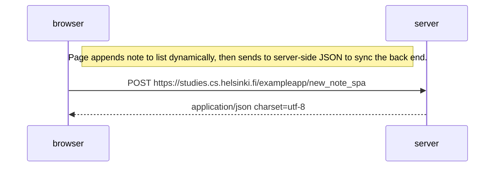

```mermaid
  sequenceDiagram
    participant browser
    participant server

    Note right of browser: Page appends note to list dynamically, then sends to server-side JSON to sync the back end.

    browser->>server: POST https://studies.cs.helsinki.fi/exampleapp/new_note_spa
    server-->>browser: application/json charset=utf-8

```